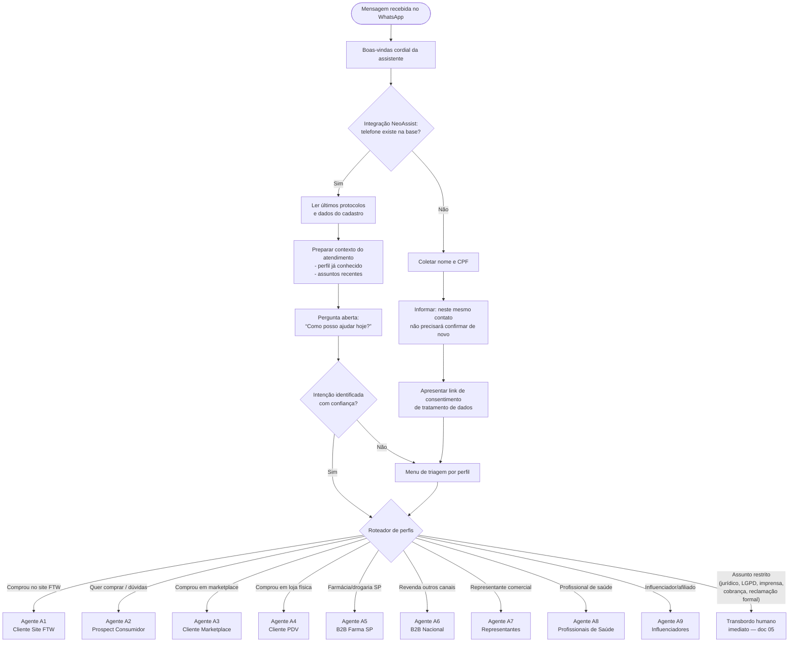

# 02 — Fluxo mestre: entrada, identificação e triagem (Número Consumidor)

> Este é o fluxo de automação principal a ser montado na NeoAssist para o canal WhatsApp **(11) 2388-3360**. Ele identifica quem está entrando em contato e roteia para o agente de IA do perfil correto (A1 a A9).

## 1. Visão geral do fluxo

## 2. Etapa 1 — Boas-vindas

A assistente **sempre inicia se apresentando com cordialidade** e dizendo que está ali para ajudar rapidamente.

Modelo (em blocos curtos, conforme regra de ritmo do documento 01):

> Oi! Eu sou a [Assistente de IA Fitoway], assistente virtual do Grupo Fitoway. 😊
>
> Estou aqui para te ajudar de forma rápida.

*(aguarda ~2 segundos de respiro antes do próximo bloco — usar o recurso de atraso entre mensagens do fluxo NeoAssist)*

## 3. Etapa 2 — Identificação automática (integração de consumidor NeoAssist)

Em paralelo à saudação, o fluxo consulta a **integração de consumidor da NeoAssist** usando o **número de telefone** que está entrando em contato:

### 3.1 Cliente encontrado na base

1. Recuperar o cadastro (nome, perfil já classificado em contatos anteriores).
2. **Ler os últimos protocolos** do cliente para se preparar para o atendimento (ex.: pedido em aberto, reclamação recente, cotação B2B em andamento).
3. Saudar pelo nome e, se houver protocolo recente em aberto, **oferecer continuidade** antes de qualquer menu:

> Que bom te ver de novo, [Nome]!
>
> Vi aqui que seu último contato foi sobre [assunto do protocolo]. Quer continuar esse assunto ou falar de algo novo?

4. Se o perfil do cliente já é conhecido (ex.: cliente B2B Farma SP), rotear direto para o agente do perfil, sem menu.

### 3.2 Cliente NÃO encontrado na base

1. Coletar **nome completo** e **CPF** (ou **CNPJ**, se a pessoa se identificar como empresa/revenda — ver triagem):

> Para eu conseguir te atender direitinho, pode me dizer seu nome completo?

*(aguarda resposta)*

> Obrigada, [Nome]! Agora preciso do seu CPF, só para criar seu cadastro com segurança.

2. **Informar a conveniência do cadastro**:

> Prontinho. Sempre que você falar com a gente por este mesmo número, não vai precisar confirmar seus dados de novo.

3. **Apresentar o link de consentimento de tratamento de dados (LGPD)**:

> Antes de seguir: a gente cuida dos seus dados conforme a LGPD. Aqui está o termo de consentimento para você conferir e aceitar: [LINK_CONSENTIMENTO]
>
> Posso continuar?

4. Registrar o aceite (data/hora + versão do termo) via integração antes de prosseguir. Se o usuário recusar, explicar que sem o consentimento só é possível atendimento humano e ofertar o transbordo.

### 3.3 Validação de identidade para dados de conta

Consultas que exponham dados de pedido/conta exigem validação: o CPF/CNPJ informado deve **bater com o cadastro** vinculado ao pedido. Sem validação, a assistente não confirma informações de conta (regra do documento 01, seção 6).

## 4. Etapa 3 — Triagem de perfil

Se a intenção não ficou clara na pergunta aberta, apresentar o menu de triagem (lista interativa do WhatsApp):

> Para te direcionar para o time certo, me conta: qual dessas opções combina com você?
>
> 1. Comprei no site ftw.com.br
> 2. Quero comprar / conhecer os produtos
> 3. Comprei em marketplace (Mercado Livre, Amazon…)
> 4. Comprei em loja física
> 5. Sou farmácia ou drogaria (SP)
> 6. Sou lojista / revenda (outros canais)
> 7. Sou representante comercial
> 8. Sou profissional de saúde e quero parceria
> 9. Sou influenciador(a) e quero ser afiliado(a)

### 4.1 Regras do roteador

| Resposta / intenção detectada | Destino | Observação |
|---|---|---|
| 1 — Comprou no site | **A1** | Validar CPF × pedido antes de expor dados |
| 2 — Quer comprar | **A2** | Prospect: foco em conversão |
| 3 — Marketplace | **A3** | Identificar marketplace e nº do pedido |
| 4 — Loja física / PDV | **A4** | Orientação e coleta de dados da loja |
| 5 — Farmácia/drogaria | Se **UF = SP** → **A5**; demais UFs → **A6** | Perguntar cidade/UF e CNPJ |
| 6 — Revenda outros canais | **A6** | Alimentar, varejo, BodyShop, canal verde, farma fora de SP |
| 7 — Representante | **A7** | Validar vínculo na base de representantes |
| 8 — Profissional de saúde | **A8** | Coletar registro profissional (CRM/CRN) |
| 9 — Influenciador | **A9** | Programa de afiliados |
| Jurídico, Procon/Reclame Aqui, advogado, dívida/cobrança, LGPD, imprensa | **Transbordo humano imediato** | Documento 05 |
| Intenção incompreendida 2× | Oferecer transbordo | Documento 01, seção 4 |

### 4.2 Persistência do perfil

Após a triagem, o perfil identificado é **gravado no cadastro do contato** (campo customizado na NeoAssist). Nos próximos contatos o roteamento é direto, e o menu só reaparece se o usuário disser que o assunto é de outro perfil ("agora estou falando como representante", por exemplo).

### 4.3 Troca de perfil no meio da conversa

Se durante o atendimento ficar claro que o usuário pertence a outro perfil (ex.: entrou como consumidor, mas é uma farmácia querendo revender), o agente atual faz **hand-off interno** para o agente correto, levando o resumo da conversa — o usuário não repete nada.

## 5. Regras transversais do fluxo mestre

- **Blocos curtos** com pausas entre mensagens (documento 01, seção 2.1).
- **Áudio**: se a mensagem do usuário chegar em áudio, transcrever (recurso da plataforma), processar normalmente e responder em áudio.
- **Fora do horário humano**: o fluxo de IA funciona 24/7; apenas transbordos seguem a regra de horário do documento 05.
- **Mensagens não suportadas** (figurinha, imagem sem texto, contato): responder pedindo uma descrição em texto do que a pessoa precisa; na segunda falha, oferecer transbordo.
- **Inatividade**: sem resposta por 30 minutos, enviar 1 lembrete gentil; sem resposta por mais 24h, encerrar com protocolo e mensagem de retorno.
- **Encerramento**: sempre com a pergunta de resolução (documento 01, seção 5).

## 6. Nós de automação NeoAssist (checklist de montagem)

1. **Gatilho**: nova conversa no canal WhatsApp (11) 2388-3360.
2. **Ação — mensagem**: boas-vindas (2 blocos com atraso).
3. **Ação — integração**: `GET consumidor por telefone` (documento 03, I-01).
4. **Condição**: consumidor encontrado?
   - Sim → **Ação — integração**: `GET últimos protocolos` (I-02) → condição "protocolo em aberto?" → mensagem de continuidade.
   - Não → subfluxo de cadastro (nome → CPF → aviso → link LGPD (I-03) → registro do aceite).
5. **Entrada do usuário** (pergunta aberta) → **classificação de intenção Núb.ia**.
6. **Condição**: confiança da intenção ≥ limiar? Se não → **menu interativo** de triagem.
7. **Roteador** (switch por perfil) → **hand-off para o agente Núb.ia Resolve** do perfil (A1–A9), passando variáveis: nome, documento, perfil, protocolos recentes, resumo da triagem.
8. **Ramo de exceção**: assuntos restritos → fila humana correspondente (documento 05).
9. **Pós-conversa**: gravação do perfil no cadastro, tag do assunto, pesquisa de resolução.
